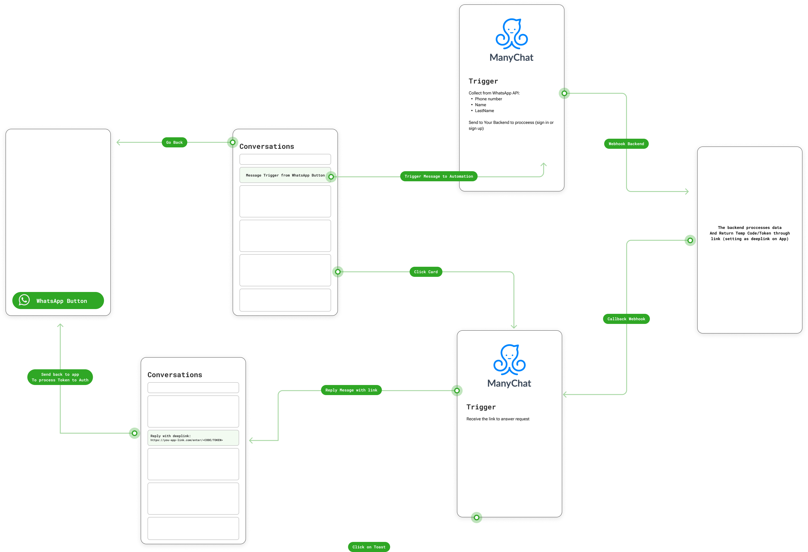

# React Native WhatsApp Login Button

A WhatsApp signIn or signUp button for React Native and Expo.

## Motivation

I needed a WhatsApp login button for a project, and all the templates I found were for SMS registration or Social Login. 

Even with the popularity of WhatsApp, at most it was used to receive a code for the user to exit the app, copy the code in WhatsApp, return to the app, and paste it.

None worked like the social login mode (like OAuth). 

So I decided to create a simple and easy-to-use one.

## How it works




- When the button is pressed, it opens the WhatsApp app with the number and message configured in the .env file.

- Then you can configure your automation service to respond automatically to the user. Setting the `DEFAULT_MESSAGE_LOGIN` in the .env file.

- A automation service should respond with a link, to the deeplink lead to the app and in the `callbackScreen` method login/register the user.
 

## Installation

```bash
npm install whatsapp-auth
# or
yarn add whatsapp-auth
```

## Environment Variables

- `WHATSAPP_NUMBER_CORE`: The WhatsApp number to be used in the button.
- `DEFAULT_MESSAGE_LOGIN`: The default message to be used in the button.


## Props

- `whatsappNumberCore`: If not provided, the number will be taken from the .env file. The WhatsApp number to be used in the button.
- `defaultMessageLogin`: If not provided, the message will be taken from the .env file. The default message to be used in the button.
- `buttonText`: The text to be used in the button.

## Methods

- `callbackScreen`: A function to be called when the button is pressed.

## Example

```tsx
import { WhatsappButton } from 'whatsapp-auth';
import {useNavigation} from '@react-navigation/native';


const App = () => {
  const navigation = useNavigation();

  const callBackScreen = () => {
    console.log('Callback screen');
    navigation.navigate('CodeVerification');
  };

  return <WhatsappButton 
            callBackScreen={callBackScreen}
            whatsappNumberCore={'5511999999999'} // International format (only numbers)
            defaultMessageLogin={'Hello, I want to sign up'}
            buttonText={'Sign Up with WhatsApp'}
          />;
};
``` 
